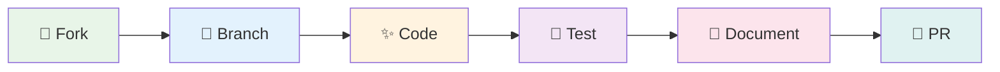
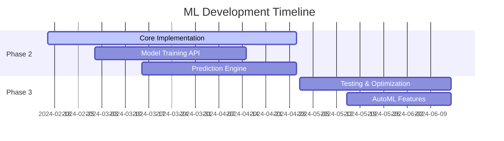

# 🎨 Contributing to DataNotebook Platform

<div align="center">

### *Welcome to our handwritten data adventure!* ✨

**Thank you for your interest in contributing to DataNotebook - where data analysis meets artistic expression**

[](https://github.com/Kedhareswer/Data_Science_Platform)
[](https://github.com/Kedhareswer/Data_Science_Platform)

</div>

---

## 🌟 Our Vision

DataNotebook is more than just a data analysis platform - it's a creative space where data scientists, analysts, and researchers can explore their data through a beautifully crafted, handwritten-style interface. We believe that beautiful tools inspire beautiful work.

## 🎯 How to Contribute



### 🚀 Quick Start for Contributors

1. **🍴 Fork the Repository**
   ```bash
   # Click the "Fork" button on GitHub
   # Then clone your fork
   git clone https://github.com/YOUR_USERNAME/Data_Science_Platform.git
   cd Data_Science_Platform
   ```

2. **📦 Install Dependencies**
   ```bash
   npm install
   # or
   yarn install
   ```

3. **🌿 Create a Feature Branch**
   ```bash
   git checkout -b feature/your-amazing-handwritten-feature
   ```

4. **🔥 Start Development Server**
   ```bash
   npm run dev
   ```

## 🎨 Contribution Areas

<div align="center">

| 🎭 Area | 📝 Description | 🌟 Priority | 🎯 Skills Needed |
|---------|----------------|-------------|------------------|
| **🎨 UI/UX Design** | Enhance handwritten aesthetics, improve user experience | High | CSS, Design, Accessibility |
| **📊 Data Features** | New visualization types, data processing improvements | High | React, TypeScript, Data Viz |
| **🤖 ML Features** | Help build machine learning capabilities | Very High | Python, ML, React |
| **📚 Documentation** | Improve guides, add examples, write tutorials | Medium | Writing, Examples |
| **🐛 Bug Fixes** | Fix issues, improve performance, enhance stability | High | Debugging, Testing |
| **🔧 DevOps** | CI/CD, deployment, performance optimization | Medium | DevOps, Performance |

</div>

## 🎨 Design Guidelines

### 🖋️ Handwritten Aesthetic

Our platform embraces a unique handwritten aesthetic. When contributing UI changes:

- **Font Family**: Use `"Comic Sans MS", "Brush Script MT", "Lucida Handwriting", cursive`
- **Color Palette**: Soft, warm colors that feel organic and friendly
- **Animations**: Gentle, natural transitions that feel hand-drawn
- **Icons**: Prefer rounded, friendly icons from Lucide
- **Spacing**: Generous whitespace for a clean, notebook-like feel

### 🎯 Code Style

```typescript
// ✅ Good: Descriptive, handwritten-style naming
const createHandwrittenNotebook = () => {
  // Beautiful, readable code here
}

// ✅ Good: Clear component structure
export function WhimsicalDataTable({ data }: DataTableProps) {
  return (
    <div className="handwritten-table-container">
      {/* Magical data rendering */}
    </div>
  )
}
```

## 🧪 Testing Guidelines

### 🔍 Before Submitting

- [ ] **✨ Code Quality**: Run `npm run lint` and fix any issues
- [ ] **📋 Type Safety**: Run `npm run type-check` for TypeScript validation
- [ ] **🎨 Visual Testing**: Test your changes in both light and dark modes
- [ ] **📱 Responsive**: Ensure your changes work on desktop and tablet
- [ ] **♿ Accessibility**: Test with screen readers and keyboard navigation

### 🧪 Testing Commands

```bash
# 🔍 Lint your magical code
npm run lint

# 📋 Check TypeScript spells
npm run type-check

# 🏗️ Build the enchanted platform
npm run build

# 🚀 Test production build
npm start
```

## 📝 Commit Guidelines

We follow a whimsical yet structured commit convention:

### 🎨 Commit Format

```
✨ feat: add magical data visualization component
🐛 fix: resolve handwritten font loading issue
📚 docs: update contributing guidelines with examples
🎨 style: improve notebook cell spacing
🔧 refactor: reorganize data processing utilities
🧪 test: add tests for visualization components
```

### 🌟 Commit Types

| 🎯 Type | 📝 Description | 🎨 Example |
|---------|----------------|------------|
| `✨ feat` | New features | `✨ feat: add ML model trainer component` |
| `🐛 fix` | Bug fixes | `🐛 fix: resolve cell scrolling issue` |
| `📚 docs` | Documentation | `📚 docs: add data import tutorial` |
| `🎨 style` | UI/styling changes | `🎨 style: enhance handwritten button design` |
| `🔧 refactor` | Code refactoring | `🔧 refactor: improve data context structure` |
| `🧪 test` | Adding tests | `🧪 test: add visualization component tests` |

## 🤖 ML Features Development

> 🚧 **Special Focus Area**: We're actively building ML capabilities!

If you're interested in contributing to our machine learning features:

### 🎯 Current ML Roadmap



### 🛠️ ML Tech Stack

- **Backend**: Python with FastAPI for ML services
- **Models**: Scikit-learn, XGBoost, LightGBM
- **Frontend Integration**: React components for ML workflows
- **Data Pipeline**: Pandas, NumPy for data processing

## 📋 Pull Request Process

### 🎯 PR Checklist

- [ ] **📝 Clear Title**: Use descriptive title with appropriate emoji
- [ ] **📚 Description**: Explain what changes you made and why
- [ ] **🎨 Screenshots**: Include before/after screenshots for UI changes
- [ ] **🧪 Testing**: Describe how you tested your changes
- [ ] **📋 Breaking Changes**: Note any breaking changes
- [ ] **🔗 Issue Link**: Reference related issues with `Fixes #123`

### 🎨 PR Template

```markdown
## 🎯 What does this PR do?

Brief description of your magical changes.

## 🎨 Type of Change

- [ ] ✨ New feature
- [ ] 🐛 Bug fix
- [ ] 📚 Documentation update
- [ ] 🎨 Style/UI improvement
- [ ] 🔧 Refactoring

## 🧪 How Has This Been Tested?

Describe your testing process:
- [ ] Local development testing
- [ ] Cross-browser testing
- [ ] Mobile/responsive testing
- [ ] Accessibility testing

## 📸 Screenshots (if applicable)

Before:
[Screenshot]

After:
[Screenshot]

## 📋 Checklist

- [ ] My code follows the handwritten aesthetic guidelines
- [ ] I have performed a self-review of my code
- [ ] I have commented my code where necessary
- [ ] My changes generate no new warnings
- [ ] I have added tests that prove my fix is effective
```

## 🎨 Component Development Guidelines

### 🧩 Creating New Components

When creating new components for DataNotebook:

```typescript
// 📁 components/ui/handwritten-button.tsx
"use client"

import type React from "react"
import { cn } from "@/lib/utils"

interface HandwrittenButtonProps extends React.ButtonHTMLAttributes<HTMLButtonElement> {
  variant?: "default" | "outline" | "ghost"
  size?: "sm" | "md" | "lg"
  whimsical?: boolean
}

export function HandwrittenButton({ 
  className, 
  variant = "default", 
  size = "md",
  whimsical = true,
  ...props 
}: HandwrittenButtonProps) {
  return (
    <button
      className={cn(
        // Base handwritten styles
        "font-handwritten transition-all duration-200",
        "hover:scale-105 active:scale-95",
        
        // Variant styles
        {
          "bg-primary text-primary-foreground hover:bg-primary/90": variant === "default",
          "border-2 border-dashed hover:border-solid": variant === "outline",
          "hover:bg-accent": variant === "ghost",
        },
        
        // Size styles
        {
          "px-3 py-1 text-sm": size === "sm",
          "px-4 py-2": size === "md", 
          "px-6 py-3 text-lg": size === "lg",
        },
        
        // Whimsical effects
        whimsical && "transform rotate-1 hover:rotate-0",
        
        className
      )}
      {...props}
    />
  )
}
```

## 🌍 Community Guidelines

### 🤝 Code of Conduct

We are committed to providing a welcoming and inspiring community for all. Please:

- **🎨 Be Creative**: Embrace the handwritten aesthetic and think outside the box
- **🤝 Be Respectful**: Treat everyone with kindness and respect
- **📚 Be Helpful**: Help others learn and grow
- **🎯 Be Constructive**: Provide helpful feedback and suggestions
- **✨ Be Inclusive**: Welcome contributors of all skill levels

### 💬 Communication Channels

- **🐛 Issues**: Use GitHub Issues for bug reports and feature requests
- **💡 Discussions**: Use GitHub Discussions for questions and ideas
- **📧 Email**: Contact [kedhareswer@example.com](mailto:kedhareswer@example.com) for sensitive matters

## 🎉 Recognition

Contributors who make significant contributions will be:

- **🌟 Featured**: Listed in our README contributors section
- **🏆 Credited**: Mentioned in release notes
- **🎨 Showcased**: Featured in our documentation examples
- **💝 Appreciated**: Receive our heartfelt thanks and digital high-fives!

## 📚 Resources

### 🛠️ Development Resources

- **[Next.js Documentation](https://nextjs.org/docs)** - Learn about our framework
- **[Tailwind CSS](https://tailwindcss.com/docs)** - Understand our styling approach
- **[Radix UI](https://www.radix-ui.com/)** - Explore our component library
- **[TypeScript Handbook](https://www.typescriptlang.org/docs/)** - Master type safety

### 🎨 Design Resources

- **[Handwritten Fonts Guide](https://fonts.google.com/?category=Handwriting)** - Typography inspiration
- **[Color Palette Tools](https://coolors.co/)** - Create harmonious color schemes
- **[Accessibility Guidelines](https://www.w3.org/WAI/WCAG21/quickref/)** - Ensure inclusive design

---

<div align="center">

### 🎨 *Thank you for contributing to DataNotebook!* ✨

**Together, we're building something magical where data analysis meets artistic expression**

[](https://github.com/Kedhareswer/Data_Science_Platform/graphs/contributors)
[](https://github.com/Kedhareswer/Data_Science_Platform/stargazers)

*Made with handwritten love by the DataNotebook community* 💝

</div>
