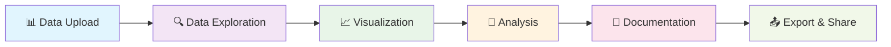
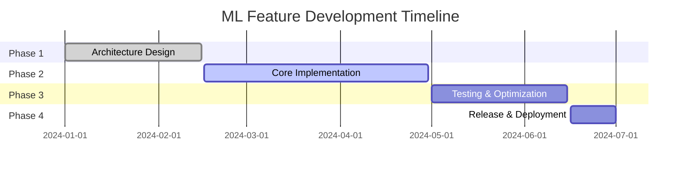
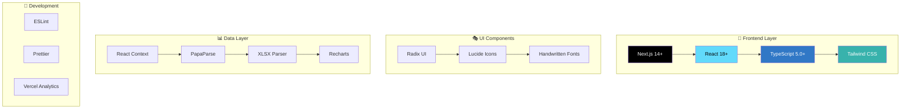
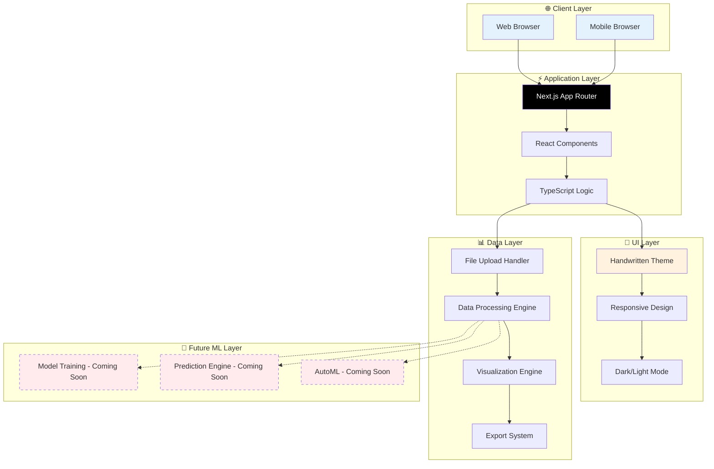
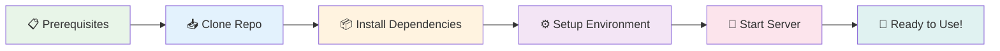

<div align="center">

# 🌟 DataNotebook Platform 🔬

*A whimsical, handwritten-style data analysis platform*

[](https://nextjs.org/)
[](https://www.typescriptlang.org/)
[](https://tailwindcss.com/)
[](https://reactjs.org/)

[](https://opensource.org/licenses/MIT)
[](http://makeapullrequest.com)
[](https://github.com/Kedhareswer/Data_Science_Platform)
[](https://your-deployment-url.com)

</div>

---

<div align="center">

### 🎨 *"Where data meets creativity in a handwritten world"*

**Transform your data into actionable insights through an intuitive, beautifully crafted notebook interface with a unique handwritten aesthetic.**

</div>

## 🎯 Platform Overview



## ✨ Current Features

<div align="center">

| 🎨 Feature | 📝 Description | 🚀 Status |
|------------|----------------|-----------|
| 📊 **Interactive Notebooks** | Create, organize, and share analysis notebooks with rich text editing | ✅ **Live** |
| 📈 **Data Visualization** | Create stunning visualizations with multiple chart types | ✅ **Live** |
| 📥 **Data Import** | Support for CSV, Excel, JSON file formats | ✅ **Live** |
| 🧮 **Data Processing** | Built-in tools for data cleaning and transformation | ✅ **Live** |
| 👨‍💻 **Code Editor** | Syntax highlighting and autocompletion | ✅ **Live** |
| 🌓 **Theme Support** | Dark and light mode with handwritten aesthetics | ✅ **Live** |
| 📱 **Responsive Design** | Optimized for desktop and tablet devices | ✅ **Live** |
| 🔐 **Privacy & Terms** | Professional legal pages with comprehensive coverage | ✅ **Live** |

</div>

## 🤖 Machine Learning Features

<div align="center">

> 🚧 **Coming Soon** - ML features are currently under active development!

</div>



### 🔮 Planned ML Capabilities

| 🧠 Feature | 📋 Description | 📅 Timeline |
|------------|----------------|-------------|
| 🏗️ **ML Model Trainer** | Train various ML models with customizable parameters | Q2 2024 |
| 🎯 **ML Predictor** | Make predictions using trained models | Q2 2024 |
| 🔄 **Auto ML Trainer** | Automatically train and compare multiple models | Q3 2024 |
| 📊 **Model Insights** | Feature importance and model interpretability | Q3 2024 |
| 🏆 **Model Comparison** | Compare and analyze different ML models | Q3 2024 |

## 🛠️ Tech Stack

<div align="center">

### 🎨 *Built with love using modern technologies*

</div>



<details>
<summary>📋 <strong>Detailed Technology Breakdown</strong></summary>

| 🏷️ Category | 🛠️ Technologies | 📝 Purpose |
|-------------|-----------------|------------|
| **🎨 Frontend** | Next.js 14+, React 18+, TypeScript 5.0+ | Modern web framework with type safety |
| **🎭 UI/UX** | Radix UI, Tailwind CSS, Lucide Icons | Accessible components with handwritten aesthetics |
| **📊 Data** | React Context API, PapaParse, XLSX | State management and file processing |
| **📈 Visualization** | Recharts, Custom Charts | Interactive data visualization |
| **🔧 Development** | ESLint, Prettier, Vercel Analytics | Code quality and performance monitoring |
| **🎨 Styling** | Comic Sans MS, Brush Script MT, Lucida Handwriting, Bradley Hand, Segoe Print, cursive | Unique handwritten font experience |

</details>

## 🏗️ System Architecture



## 🚀 Quick Start

<div align="center">

### 🎯 *Get up and running in minutes!*

</div>



### 📋 Prerequisites

<div align="center">

| 🛠️ Requirement | 📊 Version | 🔗 Download |
|----------------|------------|-------------|
| **Node.js** | ≥18.0.0 | [nodejs.org](https://nodejs.org/) |
| **npm/yarn** | Latest | Included with Node.js |
| **Git** | Latest | [git-scm.com](https://git-scm.com/) |

</div>

### 🎯 Installation Flow

```bash
# 📥 Step 1: Clone the magical repository
git clone https://github.com/Kedhareswer/Data_Science_Platform.git
cd Data_Science_Platform

# 📦 Step 2: Install the enchanted dependencies
npm install
# ✨ or with yarn magic
yarn install

# ⚙️ Step 3: Setup your environment spells
cp .env.example .env.local

# 🚀 Step 4: Launch your data adventure!
npm run dev
# 🌟 or with yarn power
yarn dev
```

<div align="center">

### 🎉 **Success!** 
Visit [http://localhost:3000](http://localhost:3000) to enter your handwritten data wonderland!

</div>

## 📁 Project Structure

<div align="center">

### 🏗️ *Beautifully organized, handwritten-style architecture*

```mermaid
graph TD
    A[🏠 DataNotebook Platform] --> B[📱 app/]
    A --> C[🧩 components/]
    A --> D[📚 lib/]
    A --> E[🌍 public/]
    
    B --> B1[🏠 page.tsx - Landing]
    B --> B2[📊 notebook/ - Analysis Interface]
    B --> B3[📖 docs/ - Documentation]
    B --> B4[📜 terms/ - Terms of Service]
    B --> B5[🔒 privacy/ - Privacy Policy]
    
    C --> C1[🎨 ui/ - Reusable Components]
    C --> C2[📈 charts/ - Visualizations]
    C --> C3[📝 forms/ - Input Forms]
    C --> C4[🧭 navigation/ - Navigation]
    
    D --> D1[🎣 hooks/ - Custom Hooks]
    D --> D2[🛠️ utils/ - Helper Functions]
    D --> D3[📋 types/ - TypeScript Types]
    D --> D4[🗂️ contexts/ - State Management]
    
    E --> E1[🖼️ images/ - Static Assets]
    E --> E2[📄 docs/ - Documentation Assets]
    
    style A fill:#e1f5fe
    style B fill:#f3e5f5
    style C fill:#e8f5e8
    style D fill:#fff3e0
    style E fill:#fce4ec
```

</div>



## ⚙️ Available Scripts

<div align="center">

| 🎯 Command | 📝 Description | 🚀 Usage |
|------------|----------------|----------|
| `npm run dev` | 🔥 Start development server | Hot reload enabled |
| `npm run build` | 🏗️ Build for production | Optimized bundle |
| `npm start` | ▶️ Start production server | Production ready |
| `npm run lint` | 🔍 Run ESLint | Code quality check |
| `npm run type-check` | 📋 TypeScript validation | Type safety |

</div>


## 🤝 Contributing

<div align="center">

### 🎨 *Join our handwritten data adventure!*

**We welcome contributions from developers who love beautiful, functional code**

</div>

<details>
<summary>🚀 <strong>Contribution Flow</strong></summary>

```bash
# 🍴 Step 1: Fork the magical repository
# Click the "Fork" button on GitHub

# 📥 Step 2: Clone your enchanted fork
git clone https://github.com/YOUR_USERNAME/Data_Science_Platform.git
cd Data_Science_Platform

# 🌿 Step 3: Create your feature branch
git checkout -b feature/AmazingHandwrittenFeature

# ✨ Step 4: Make your magical changes
# Add your beautiful, handwritten-style code

# 💾 Step 5: Commit your spells
git commit -m '✨ Add some AmazingHandwrittenFeature'

# 🚀 Step 6: Push to your branch
git push origin feature/AmazingHandwrittenFeature

# 🎉 Step 7: Open a Pull Request
# Create a PR with a detailed description
```

</details>

<div align="center">

### 🎯 **Contribution Guidelines**

| 🎨 Area | 📝 Focus | 🌟 Priority |
|---------|----------|-------------|
| **🎭 UI/UX** | Handwritten aesthetics, accessibility | High |
| **📊 Data Features** | New visualization types, data processing | High |
| **🤖 ML Features** | Help us build the ML capabilities! | Very High |
| **📚 Documentation** | Improve guides, add examples | Medium |
| **🐛 Bug Fixes** | Fix issues, improve performance | High |

</div>

## 📄 License

<div align="center">

**MIT License** - *Freedom to create, modify, and share*

[](https://opensource.org/licenses/MIT)

This project is licensed under the MIT License - see the [LICENSE](LICENSE) file for details.

</div>

## 🙏 Acknowledgments

<div align="center">

### 💝 *Built with love using amazing open-source tools*

</div>

<div align="center">

| 🛠️ Technology | 🎯 Purpose | 🔗 Link |
|---------------|------------|---------|
| **Next.js** | React Framework | [nextjs.org](https://nextjs.org/) |
| **Radix UI** | UI Component System | [radix-ui.com](https://www.radix-ui.com/) |
| **Tailwind CSS** | Utility-First CSS | [tailwindcss.com](https://tailwindcss.com/) |
| **Recharts** | Data Visualization | [recharts.org](https://recharts.org/) |
| **Lucide** | Beautiful Icons | [lucide.dev](https://lucide.dev/) |
| **TypeScript** | Type Safety | [typescriptlang.org](https://www.typescriptlang.org/) |

</div>

---

## ⭐ Star History

<div align="center">

**Help us reach more data enthusiasts by starring the repository**


[](https://star-history.com/#Kedhareswer/Data_Science_Platform&Date)

**If you find this project helpful, please consider giving it a ⭐**

[](https://github.com/Kedhareswer/Data_Science_Platform/stargazers)
[](https://github.com/Kedhareswer/Data_Science_Platform/network)
[](https://github.com/Kedhareswer/Data_Science_Platform/watchers)

</div>
