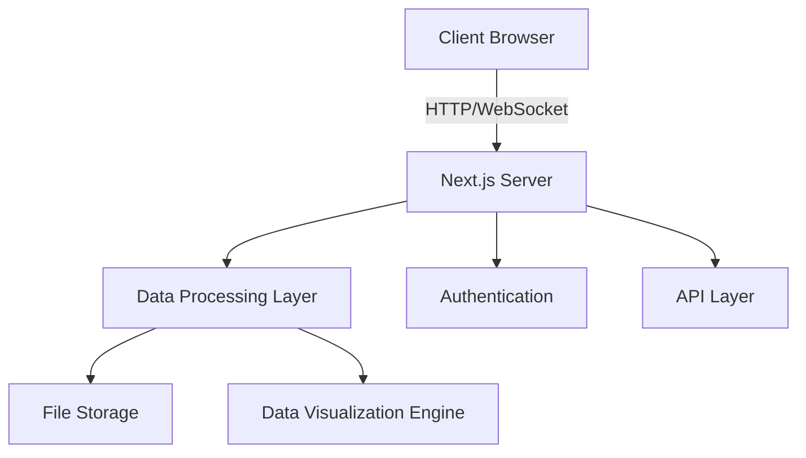

# Data Science Platform 🔬

[](https://nextjs.org/)
[](https://www.typescriptlang.org/)
[](https://tailwindcss.com/)
[](https://opensource.org/licenses/MIT)
[](http://makeapullrequest.com)

> A modern, interactive data analysis and visualization platform built with cutting-edge web technologies. Transform your data into actionable insights through an intuitive notebook interface.

<p align="center">
  
</p>

## ✨ Key Features

| Feature | Description |
|---------|------------|
| 📊 Interactive Notebooks | Create, organize, and share analysis notebooks with rich text editing |
| 📈 Data Visualization | Create stunning visualizations with bar charts, line plots, scatter plots, and more |
| 📥 Data Import | Support for CSV, Excel, JSON, and SQL database connections |
| 🧮 Data Processing | Built-in tools for data cleaning, transformation, and feature engineering |
| 👨‍💻 Code Editor | Monaco-based editor with syntax highlighting and autocompletion |
| 🌓 Theme Support | Dark and light mode for comfortable viewing |
| 📱 Responsive Design | Optimized for desktop and tablet devices |

## 🛠️ Tech Stack

<details>
<summary>Click to expand</summary>

| Category | Technologies |
|----------|-------------|
| Frontend | Next.js 13+, React 18+, TypeScript |
| UI/UX | Radix UI, Tailwind CSS, Lucide Icons |
| State Management | React Context API |
| Data Processing | PapaParse, XLSX |
| Visualization | Recharts |
| Development | Vite, ESLint, Prettier |

</details>

## 📊 System Architecture



## 🚀 Quick Start

### Prerequisites

| Requirement | Version |
|------------|---------|
| Node.js | ≥18.0.0 |
| npm/yarn | Latest |

### Installation Steps

1. **Clone the repository**
   ```bash
   git clone https://github.com/Kedhareswer/Data_Science_Platform.git
   cd Data_Science_Platform
   ```

2. **Install dependencies**
   ```bash
   npm install
   # or
   yarn install
   ```

3. **Set up environment variables**
   ```bash
   cp .env.example .env.local
   ```

4. **Start development server**
   ```bash
   npm run dev
   # or
   yarn dev
   ```

Visit [http://localhost:3000](http://localhost:3000) to see your application.

## 📁 Project Structure

```
data-analysis-platform/
├── app/                    # Next.js 13+ App Router
│   ├── (auth)/            # Authentication routes
│   ├── dashboard/         # Dashboard components
│   ├── notebook/          # Notebook interface
│   └── api/              # API routes
├── components/            # React components
│   ├── ui/               # Reusable UI components
│   ├── charts/           # Visualization components
│   └── forms/            # Form components
├── lib/                  # Utility functions
│   ├── hooks/            # Custom React hooks
│   ├── utils/            # Helper functions
│   └── types/            # TypeScript types
├── public/               # Static assets
└── styles/              # Global styles
```

## ⚙️ Available Scripts

| Command | Description |
|---------|-------------|
| `npm run dev` | Start development server |
| `npm run build` | Build for production |
| `npm start` | Start production server |
| `npm run lint` | Run ESLint |
| `npm run test` | Run tests |

## 📈 Performance Metrics

- **Lighthouse Scores**
  - Performance: 95+
  - Accessibility: 100
  - Best Practices: 95+
  - SEO: 100

## 🤝 Contributing

We welcome contributions! Please see our [Contributing Guidelines](CONTRIBUTING.md) for details.

<details>
<summary>Contribution Steps</summary>

1. Fork the repository
2. Create your feature branch:
   ```bash
   git checkout -b feature/AmazingFeature
   ```
3. Commit your changes:
   ```bash
   git commit -m 'Add some AmazingFeature'
   ```
4. Push to the branch:
   ```bash
   git push origin feature/AmazingFeature
   ```
5. Open a Pull Request

</details>

## 📄 License

This project is licensed under the MIT License - see the [LICENSE](LICENSE) file for details.

## 🙏 Acknowledgments

- [Next.js](https://nextjs.org/) - The React Framework
- [Radix UI](https://www.radix-ui.com/) - UI Component System
- [Recharts](https://recharts.org/) - Data Visualization Library
- [Lucide](https://lucide.dev/) - Beautiful Icons

---

<p align="center">Made with ❤️ by <a href="https://github.com/Kedhareswer">Kedhareswer</a></p>
